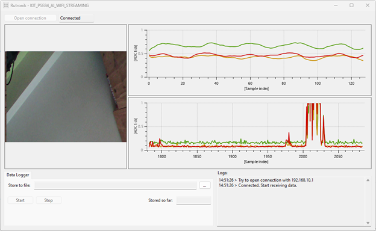

# KIT PSE84 AI: OV7675 and BGT60TR13C data streaming over Wifi

This project collects the data of the OV7675 and of the BGT60TR13C and stream them over Wifi.

Use the data logger feature to log the data and process them later on (test your algorithm, train your model, ...).

Using the generated log file and the provided Python script, you can "link" your radar data with the video stream, to verify your algorithm.

## Requirements

- [ModusToolbox&trade;](https://www.infineon.com/modustoolbox) v3.6 or later (tested with v3.6)
- Board support package (BSP) minimum required version: 1.0.0
- Programming language:
    * C: for the Firmware running on the PSoC Edge
    * C#: for the GUI
    * Python: for the analysis and video generation script
- [KIT_PSE84_AI](https://www.rutronik24.com/produit/infineon/kitpse84aitobo1/27510830.html)

## Supported kits (make variable 'TARGET')

- [PSOC&trade; Edge E84 AI Kit](https://www.infineon.com/KIT_PSE84_AI) (`KIT_PSE84_AI`)

## Supported toolchains (make variable 'TOOLCHAIN')

- GNU Arm&reg; Embedded Compiler v14.2.1 (`GCC_ARM`) - Default value of `TOOLCHAIN`

## Hardware setup

This project uses the board's default configuration.

## Operation

1. Import the project into Modus Toolbox, and build it.

2. Connect the board to your PC using the provided USB cable through the KitProg3 USB connector.

3. Open a terminal program and select the KitProg3 COM port. Set the serial port parameters to 8N1 and 115200 baud

4. After programming, the application starts automatically

5. Confirm that a green LED is flashing.

6. The device starts a "Soft AP" with name MY_SOFT_AP. Password is "psoc1234". Go to the Wifi configuration of your computer, and open a connection to this access point.

7. Start the GUI and start the streaming.

Meaning of the LEDs:
- Toggling blue: TCP server tasks send something per socket
- Toggling green: radar and camera generation task just generated data
- Green LED:
    * On: No-one connected to the access point
    * Off: A connection is opened with the access point

## GUI and python scripts

You can find the source code of the GUI (written in C#) inside the "gui/" directory, and some Python scripts for digital signal processing inside the "python/" directory.

## Legal Disclaimer

The evaluation board including the software is for testing purposes only and, because it has limited functions and limited resilience, is not suitable for permanent use under real conditions. If the evaluation board is nevertheless used under real conditions, this is done at one’s responsibility; any liability of Rutronik is insofar excluded. 

